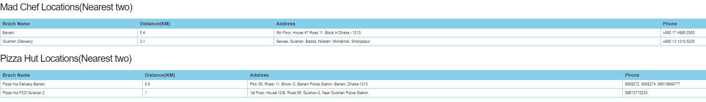

**Project** **Description**

This project is a REST API based on python flask. It provides best deal
for a certain food item based on users' location and preferred price
using data model and scrapping.

It scraps the websites of \"Mad Chef\" and \"Pizza hut\", two of the
most popular food chains in Bangladesh and stores their location, menu,
prices, and offers and updates then in a Firebase Realtime database.
Then it runs a flask server to listen for get requests. From there based
on user request a data models finds all menu items which matches with
the user request and whose prices are within +-10% of the preferred
price. The it calculates user location with all locations of both food
chains and finds two nearest branches of each restaurant. Then the API
responds to the get request with json response containing matched food
items, nearest mad chef locations and nearest pizza hut locations

This project can be divided into four major parts

1.  Data collection

2.  Database update

3.  Data modelling to find best results

4.  API building to connect and provide the results.

**Data Collection(Scraping)**

So to Collect data I have used two library namely BeatifulSoup and
Selenium. As madchef website provides open access to its menu and
locations it was easily collected using BeatifulSoup. A challenge arises
while trying to access the "Pizza Hut" menu. As it requires much more
user like approach I had to use Selenium to go to the actual menu.

The menu item name, price, short description, food category is collected
for each item found in each website for item collection. For location
collection, we have collected the branch name, address and phone
numbers.

**Database**

For the database I have decided to use "Firebase Realtime database". As
it is easy to implement, maintain, use and it serve the projects purpose
just fine. I have used pyrebase library to implement Firebase database.

**Data Modeling**

The model receives the user input FOOD ITEM, PREFERED PRICE and LOCATION
from the API. At first all menu and location data is collected from
database. Then we loop through all menu item of the restaurant and only
collect the item where the input FOOD ITEM is present is either in item
name, short description or in food category, and price of the item is
within 90% to 110% of the preferred price. This collected items from
both restaurant is our **"matched_item_list".**

**Distance calculation**

> For **distance calculation**, we tried to use google map api but it is
> locked behind paywall. So we have decided to use
> [\"https:/www.mapsofworld.com/bangladesh/distance-calculator/\"](https://www.mapsofworld.com/bangladesh/distance-calculator/).
> It is website by which the same feature can be achieved. So, we
> calculate the distance between user provided location with all the
> location of a restaurant only if that restaurant have at least one
> item in **"matched_item_list".**

Based on this calculation we select two nearest branches for each
restaurant. They are labeled as **"nearest_mad"** and "**nearest_hut**".
Then these three items are included in a dictionary for better
readability and returned to the api.

**API**

Before running the API all data are updated in database. Then REST API
will run and it will wait for htttp requests where
\"http://127.0.0.1:5000/best_deals/\" is the root-endpoint and ":
item/:pref_price/:location\" is the path. in the path \"item\" must be a
string denoting the FOOD ITEM, \"pref_price\" must be integer denoting
the PREFERED PRICE, \"location\" must be a string denoting the LOCATION
of the users. after getting a correct request the API will call the
model and send the result as JSON response containing matched food
items, nearest mad chef locations and nearest pizzahut location which
can be accessed respectively as response.item_list,
response.madChef_loaction and response.pizzahut_locations. Each of which
is a list of dictionary.

**Approach**

As I did not have any previous experience with some of the components of
this project, I have decided to follow spiral approach as it is a
risk-driven controlled prototyping approach. I developed prototypes
early in the development process to specifically address risk areas
followed by an assessment of prototyping results and further
determination of risk areas to prototype.

I continued prototyping until high-risk areas are resolved and mitigated
to an acceptable level. During each iteration or loop, the system is
explored at greater depth and more detail is added. Appropriate for
exploratory projects that are working in an unfamiliar domain or with
unproven technical approaches. The iterative nature allows for knowledge
gained during early passes to inform subsequent passes. Requires low
up-front commitment.

**Input**

<http://127.0.0.1:5000/best_deals/chicken/400/banani>

**Output**

**Postman
visualization**!(media/image2.png){width="7.311537620297463in"
height="2.891025809273841in"}

{width="7.428472222222222in"
height="1.6730774278215224in"}

**Postman Tests for visualization**

var template **=** \`

    \<style type=\"text/css\"\>

        .tftable {font-size:14px;color:\#333333;width:100%;border-width: 1px;border-color: \#87ceeb;border-collapse: collapse;}

        .tftable th {font-size:18px;background-color:\#87ceeb;border-width: 1px;padding: 8px;border-style: solid;border-color: \#87ceeb;text-align:left;}

        .tftable tr {background-color:\#ffffff;}

        .tftable td {font-size:14px;border-width: 1px;padding: 8px;border-style: solid;border-color: \#87ceeb;}

        .tftable tr:hover {background-color:\#e0ffff;}

    \</style\>

    \<h3\> Availbale Items\</h3\>

    \<table class=\"tftable\" border=\"1\"\>

        \<tr\>

            \<th\>Item Name\</th\>

            \<th\>Resturant\</th\>

            \<th\>Price\</th\>

            \<th\>Catagory\</th\>

            \<th\>Description\</th\>

        \</tr\>

        {{\#each response.item_list}}

            \<tr id=row\_{{\@key}} onClick=\"handleClick(this.id)\"\>

                \<td id={{\@key}}\>{{item_name}}\</td\>

                \<td\>{{resturant}}\</td\>

                \<td\>{{price}}\</td\>

                \<td\>{{catagory}}\</td\>

                \<td\>{{description}}\</td\>

            \</tr\>

        {{/each}}

    \</table\>

    \<h3\>Mad Chef Locations(Nearest two)\</h3\>

    \<table class=\"tftable\" border=\"1\"\>

        \<tr\>

            \<th\>Brach Name\</th\>

            \<th\>Distance(KM)\</th\>

            \<th\>Address\</th\>

            \<th\>Phone\</th\>

        \</tr\>

        

        {{\#each response.madChef_loaction}}

            \<tr id=row\_{{\@key}} onClick=\"handleClick(this.id)\"\>

                \<td id={{\@key}}\>{{branch_name}}\</td\>

                \<td\>{{distance}}\</td\>

                \<td\>{{address}}\</td\>

                \<td\>{{phone}}\</td\>

            \</tr\>

        {{/each}}

    \</table\>

    \<h3\>Pizza Hut Locations(Nearest two)\</h3\>

    \<table class=\"tftable\" border=\"1\"\>

        \<tr\>

            \<th\>Brach Name\</th\>

            \<th\>Distance(KM)\</th\>

            \<th\>Address\</th\>

            \<th\>Phone\</th\>

        \</tr\>

        

        {{\#each response.pizzahut_locations}}

            \<tr id=row\_{{\@key}} onClick=\"handleClick(this.id)\"\>

                \<td id={{\@key}}\>{{branch_name}}\</td\>

                \<td\>{{distance}}\</td\>

                \<td\>{{address}}\</td\>

                \<td\>{{phone}}\</td\>

            \</tr\>

        {{/each}}

    \</table\>

\`;

pm.visualizer.**set**(template, {

    response: pm.response.json()

});
